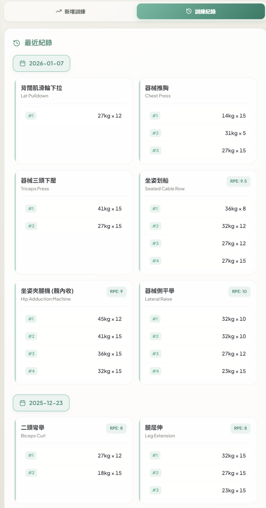
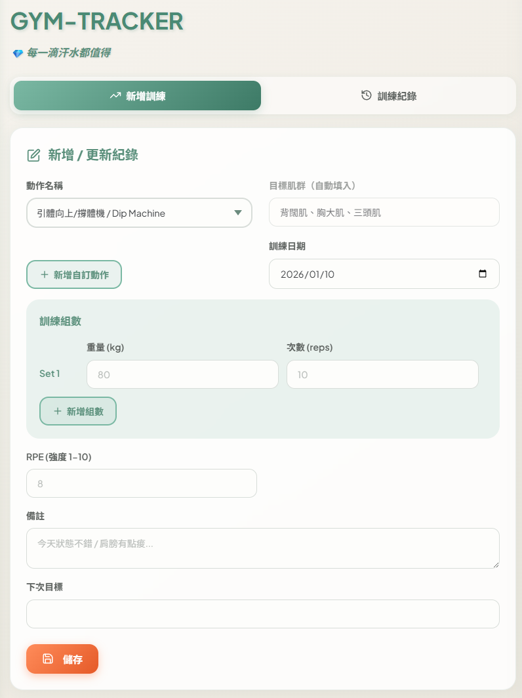
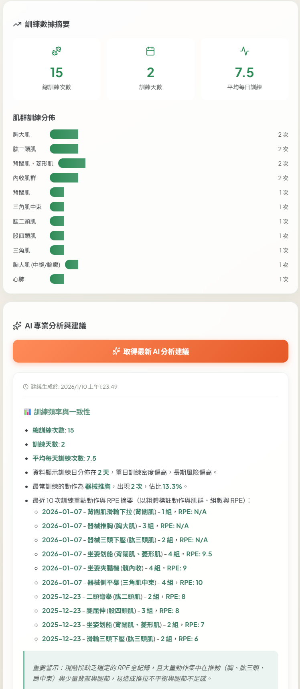

# 🏋️ My Gym Tracker

> **A personal fitness data hub built for efficiency and control.** A lightweight web app designed for fitness enthusiasts who want a minimalist, fast, and fully self-managed training log experience.

---

## 🌟 Project Highlights

This is more than just a logging tool—it's a showcase of **"how to achieve zero-cost infrastructure while maintaining performance and security."**

* **Serverless Architecture**: Leverages Google Apps Script as a middleware API for completely free backend operations.
* **Full Data Ownership**: All data is stored directly in your Google Sheets—export and analyze anytime.
* **Lightning-Fast UX**: Mobile-optimized responsive interface with dark mode support for seamless gym logging.
* **Data Visualization**: Integrated with Recharts for intuitive analysis of muscle group distribution and training trends.
* **Interactive Analytics**: Click-to-explore charts with detailed exercise history and progress tracking.

## ✨ Key Features

* 📝 **Smart Training Logs**: Auto-fill previous session data for quick weight, reps, RPE, and notes entry.
* 📊 **Interactive Dashboard**: Visualize training distribution, track progress with dynamic charts, and drill down into exercise-specific stats.
* 🤖 **AI Assistant Coach**: Generates personalized training advice by analyzing your workout frequency, volume, and muscle balance to help optimize your routine.
* 🏃 **Cardio Support**: Dedicated inputs for speed, incline, and time—seamlessly integrated with existing data structure.
* 🎯 **Custom Exercise Library**: Flexibly add personalized exercises with localStorage persistence.
* 🌙 **Dark Mode**: Minimalist UI design that adapts to any lighting environment.
* 👥 **Multi-User Support**: Switch between users (e.g., Bruce & Linda) with personalized themes.
* 📖 **Version Changelog System**: Auto-parses CHANGELOG.md to display app evolution history.
* � **Simple Security**: Frontend password protection + Backend token validation for privacy.
* �📱 **Fluid Responsive Design**: Perfectly adapts from desktop to mobile screens.

## 🛠 Tech Stack

### Frontend

- **Framework**: `React 18` (TypeScript)
* **Build Tool**: `Vite`
* **Charts**: `Recharts` (for statistical visualizations)
* **Icons**: `Lucide React`
* **Styling**: `Vanilla CSS` (precise control over details)

### Backend & Data

- **API Server**: `Google Apps Script` (GAS)
* **Storage**: `Google Sheets`
* **Auth**: `Apps Script Session Auth` + `Secret Token` dual verification

---

## 📂 Documentation

* **Feature Guide**: See [FEATURES.md](./FEATURES.md)
* **Changelog**: See [CHANGELOG.md](./CHANGELOG.md)
* **Setup & Deployment**: See [docs/TOKEN_SETUP.md](./docs/TOKEN_SETUP.md)
* **📦 Workout Menu Cloud Sync**: See [MENU_SYNC_SETUP.md](./MENU_SYNC_SETUP.md) for syncing custom workout packages to Google Sheets

---

## 👨‍💻 About

This is a **side project** I developed to demonstrate my approach to web performance optimization, lightweight backend integration, and user experience design. If you're interested in this project or want to discuss tech, feel free to reach out!

* **Portfolio**: [bruce-lcz.github.io](https://bruce-lcz.github.io)
* **GitHub**: [@bruce-lcz](https://github.com/bruce-lcz)

---

## 📸 App Visuals

### Dashboard Analytics

Interactive 3D muscle visualization and training distribution statistics to track your progress at a glance.

### Training Records History

Clean, card-based history view showing sets, reps, weights, and RPE for every session.

### Smart Training Log

Streamlined data entry with auto-fill capabilities for quick logging during workouts.

### AI Coach Intelligence

Built-in AI analyzes your workout frequency, volume, and muscle balance to provide personalized training advice.

---

## 🚀 Quick Start

1. Clone the repository
2. Install dependencies: `npm install`
3. Set up your Google Apps Script backend (see [docs/TOKEN_SETUP.md](./docs/TOKEN_SETUP.md))
4. Configure `.env.local` with your API endpoint and token
5. Run dev server: `npm run dev`

---

## 📄 License

This project is open-sourced for portfolio demonstration purposes. Feel free to explore and learn from the code!
